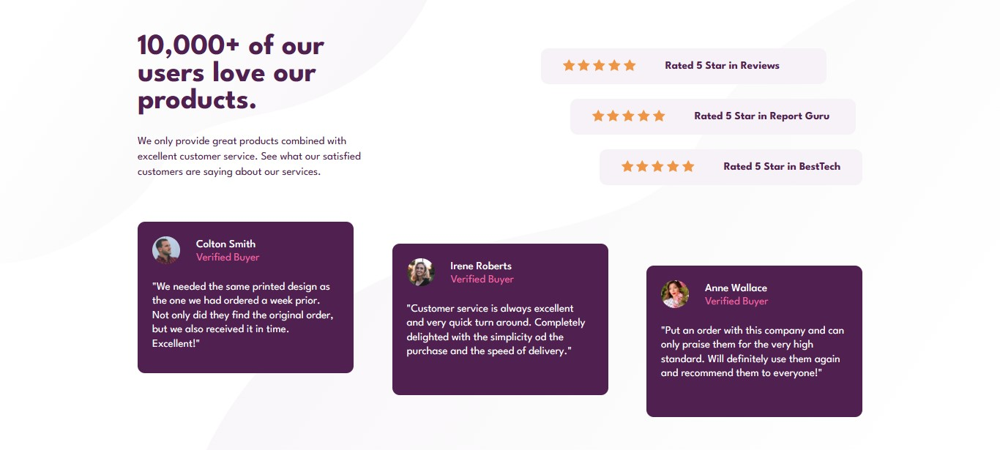

# Frontend Mentor - Solução de seção de prova social

Esta é uma solução para o [desafio da seção de provas sociais no Frontend Mentor](https://www.frontendmentor.io/challenges/social-proof-section-6e0qTv_bA). Os desafios do Frontend Mentor ajudam você a melhorar suas habilidades de codificação criando projetos realistas.

## Índice

- [Visão geral](#visão-geral)
  - [O desafio](#o-desafio)
  - [Captura de tela](#captura-de-tela)
  - [Links](#links)
- [Meu processo](#meu-processo)
  - [Construído com](#construído-com)
- [Autor](#autor)

## Visão geral

### O desafio

Os usuários devem ser capazes de:

- Veja o layout ideal para a seção, dependendo do tamanho da tela do dispositivo

### Captura de tela

### Links

- URL Repositório: [https://github.com/neirander/secao-de-prova-social](https://github.com/neirander/secao-de-prova-social)
- URL Projeto: [https://neirander.github.io/secao-de-prova-social/](https://neirander.github.io/secao-de-prova-social/)

## Meu processo

### Construído com

- HTML5 Semântico
- CSS
- Flexbox
- CSS Grid
- Mobile-first

## Autor

- Website - [engnei](https://dev.engnei.com.br)
- Frontend Mentor - [@neirander](https://www.frontendmentor.io/profile/neirander)
- Linkedin - [@engney](https://www.linkedin.com/in/engney/)
